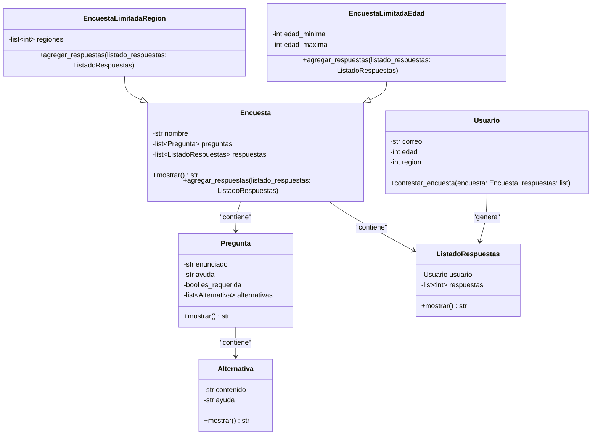

```mermaid
classDiagram
    class Usuario {
        -str correo
        -int edad
        -int region
        +contestar_encuesta(encuesta: Encuesta, respuestas: list)
    }
    class Alternativa {
        -str contenido
        -str ayuda
        +mostrar() str
    }
    class Pregunta {
        -str enunciado
        -str ayuda
        -bool es_requerida
        -list~Alternativa~ alternativas
        +mostrar() str
    }
    class Encuesta {
        -str nombre
        -list~Pregunta~ preguntas
        -list~ListadoRespuestas~ respuestas
        +mostrar() str
        +agregar_respuestas(listado_respuestas: ListadoRespuestas)
    }
    class EncuestaLimitadaEdad {
        -int edad_minima
        -int edad_maxima
        +agregar_respuestas(listado_respuestas: ListadoRespuestas)
    }
    EncuestaLimitadaEdad --|> Encuesta
    class EncuestaLimitadaRegion {
        -list~int~ regiones
        +agregar_respuestas(listado_respuestas: ListadoRespuestas)
    }
    EncuestaLimitadaRegion --|> Encuesta
    class ListadoRespuestas {
        -Usuario usuario
        -list~int~ respuestas
        +mostrar() str
    }
    Usuario --> ListadoRespuestas : "genera"
    Pregunta --> Alternativa : "contiene"
    Encuesta --> Pregunta : "contiene"
    Encuesta --> ListadoRespuestas : "contiene"
```
